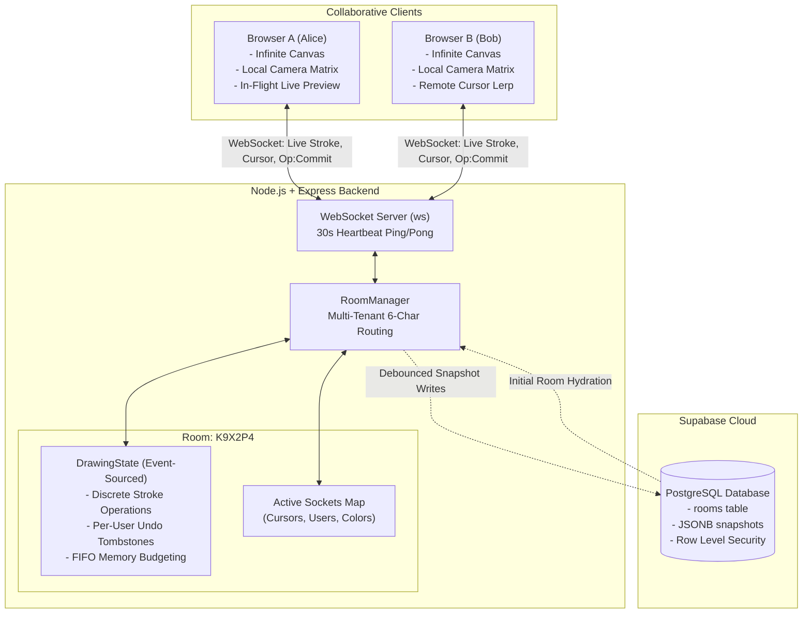

<div align="center">

# 🎨 CanvasCollab
### Production-Grade Real-Time Collaborative Whiteboard

[](https://nodejs.org/)
[](https://github.com/websockets/ws)
[](https://developer.mozilla.org/en-US/docs/Web/API/Canvas_API)
[](https://supabase.com/)
[]()
[](https://render.com)
[](LICENSE)

A high-performance, low-latency collaborative whiteboarding platform built with **Node.js**, **WebSockets**, **HTML5 Canvas 2D**, and **Supabase PostgreSQL**. Engineered with discrete stroke event sourcing, non-destructive per-user undo/redo, infinite pan & zoom with normalized coordinate projections, multi-tenant 6-character room codes, and automated test coverage.

[Features](#-key-features) • [System Architecture](#-system-architecture) • [Room Sharing](#-instant-room-sharing) • [Supabase Setup](#-database-setup-supabase) • [Deploy to Render](#-production-deployment-render) • [Resume Bullet Points](#-resume-bullet-points-star-format)

</div>

---

## 🌟 Key Features

- **⚡ Sub-30ms Real-Time Synchronization**: Full-duplex WebSocket communication streaming live in-flight strokes and remote collaborator cursors at 60 FPS with floating name tags and distinct user color allocations.
- **↩️ Non-Destructive Per-User Undo/Redo**: Implemented a tombstone (soft-delete) state model per user. When User A executes an Undo, only User A's latest stroke is hidden — leaving peer collaborators' drawings completely intact.
- **🔢 6-Character Room Codes & Link Sharing**: Create private rooms on demand. Share via human-friendly alphanumeric codes (e.g. `K9X2P4`) or instant 1-click invite URLs (`/?room=K9X2P4`).
- **🗄️ Supabase PostgreSQL Persistence**: Background debounced snapshots automatically persist canvas boards to Supabase Postgres with zero-latency in-memory caching. (Gracefully falls back to memory mode if credentials are unset).
- **📐 Infinite 2D Pan & Zoom Engine**: Affine camera matrix transformation (`screenToWorld` / `worldToScreen`) supporting smooth pan (`H` or `Space` + drag) and focal-point mouse-wheel zoom (20% to 400%).
- **🖥️ Retina / HiDPI Normalization**: Automatically calculates `window.devicePixelRatio`, preventing blurry or distorted strokes on 4K, 5K, and Retina displays.
- **🖌️ Creative Vector Toolkit**: Pen/Brush with Bézier curve smoothing, straight lines, rectangles (with optional alpha fill), circles/ellipses, and high-precision eraser.
- **💾 Export Capabilities**: One-click export to high-resolution PNG image or downloadable state JSON for backup and migration.
- **🧪 100% Native Automated Test Suite**: 11 unit and integration tests powered by Node.js's built-in test runner (`node:test`), validating room isolation, event sourcing, and multi-client socket message delivery.

---

## 📐 System Architecture



---

## 🛠️ Tech Stack Matrix

| Domain | Technology | Engineering Rationale |
|---|---|---|
| **Frontend Canvas** | HTML5 Canvas 2D, Vanilla ES6+ | Zero-framework runtime overhead, direct pixel rendering pipeline, 60 FPS animation loop. |
| **Coordinate Engine**| 2D Camera Affine Transform | DPI-independent virtual coordinate projection decoupling canvas strokes from device resolution. |
| **Backend Runtime** | Node.js, Express | Non-blocking I/O, lightweight static file delivery, and REST room provisioning. |
| **Real-Time Protocol**| Native WebSockets (`ws`) | Low-latency binary/JSON framing, bidirectional socket multiplexing, and dead-connection reaper. |
| **State Pattern** | Event Sourcing + Tombstones | Non-destructive per-user undo/redo, timeline branching, and deterministic replay. |
| **Database** | Supabase (PostgreSQL + RLS) | Reliable relational schema, JSONB canvas snapshots, and row-level security policies. |
| **Testing** | Node.js Test Runner (`node:test`) | Ultra-fast native async integration and unit testing with zero third-party dependencies. |

---

## 🚀 Quick Start

### 1. Prerequisites
- **Node.js**: v18.0.0 or higher
- **npm**: v9.0.0 or higher

### 2. Local Setup

```bash
# Clone the repository
git clone https://github.com/ShubhPatel78/collaborative-canvas.git
cd collaborative-canvas

# Install dependencies
npm install

# Run automated tests
npm test

# Start the application
npm start
```

Visit **`http://localhost:3000`** in your browser.

---

## 🔗 Instant Room Sharing

CanvasCollab makes collaboration completely frictionless without requiring sign-up walls:

1. **Create a Room**:
   - Click the **`➕ New Room`** button in the top navigation bar.
   - Enter an optional name and click **Generate Room**.
   - A unique 6-character room code (e.g. `K9X2P4`) is generated and registered.
2. **Share via Link**:
   - Click **`📋 Link`** to copy the direct URL: `http://localhost:3000/?room=K9X2P4`.
   - Send the link to a colleague; opening it connects them to the whiteboard instantly.
3. **Share via Code**:
   - Click **`🔢 Code`** to copy just the 6-character code `K9X2P4`.
   - Any collaborator can click **`🚪 Join Code`**, paste the code, and join immediately.

---

## 🗄️ Database Setup (Supabase)

The app works seamlessly out of the box using in-memory room management. To persist whiteboards across server restarts:

### Step 1: Create a Free Supabase Project
1. Go to [supabase.com](https://supabase.com) and create a free project.

### Step 2: Run the SQL Schema
1. Open your Supabase Dashboard and navigate to the **SQL Editor**.
2. Paste and run the contents of [`supabase/schema.sql`](supabase/schema.sql):

```sql
CREATE TABLE IF NOT EXISTS rooms (
    id UUID DEFAULT gen_random_uuid() PRIMARY KEY,
    code VARCHAR(12) UNIQUE NOT NULL,
    name TEXT DEFAULT 'Untitled Canvas',
    snapshot JSONB DEFAULT '{"operations": [], "activeCount": 0}'::jsonb,
    created_at TIMESTAMPTZ DEFAULT NOW(),
    updated_at TIMESTAMPTZ DEFAULT NOW()
);

CREATE INDEX IF NOT EXISTS idx_rooms_code ON rooms(code);
ALTER TABLE rooms ENABLE ROW LEVEL SECURITY;

CREATE POLICY "Public read access for rooms" ON rooms FOR SELECT USING (true);
CREATE POLICY "Public insert access for rooms" ON rooms FOR INSERT WITH CHECK (true);
CREATE POLICY "Public update access for rooms" ON rooms FOR UPDATE USING (true);
```

### Step 3: Configure Environment Variables
Copy `.env.example` to `.env`:
```bash
cp .env.example .env
```
Add your credentials from **Supabase Dashboard > Project Settings > API**:
```env
PORT=3000
SUPABASE_URL=https://your-project-id.supabase.co
SUPABASE_ANON_KEY=eyJhbGciOi...
```
Restart the server — snapshots will now automatically persist to PostgreSQL!

---

## ☁️ Production Deployment (Render)

Because CanvasCollab maintains persistent TCP WebSocket connections, **Render** is the ideal zero-configuration deployment target.

### Method A: 1-Click Blueprint Deploy (Recommended)
This repository includes a [`render.yaml`](render.yaml) configuration:

1. Push your repository to GitHub.
2. Log in to [Render.com](https://render.com).
3. Go to **Blueprints** > **New Blueprint Instance**.
4. Connect your `collaborative-canvas` repository.
5. Render will automatically detect `render.yaml` and configure the Web Service.
6. (Optional) Set `SUPABASE_URL` and `SUPABASE_ANON_KEY` under Environment Variables.
7. Click **Apply** — your app is live on a secure HTTPS/WSS URL!

### Method B: Manual Web Service
- **Build Command**: `npm install`
- **Start Command**: `npm start`
- **Health Check Path**: `/api/health`

---

## 🧪 Automated Testing

CanvasCollab maintains a zero-dependency test suite utilizing Node.js's native test runner (`node:test` & `node:assert/strict`):

```bash
npm test
```

### Test Suite Output:
```
✔ DrawingState - adds and retrieves operations (0.81ms)
✔ DrawingState - per-user non-destructive undo (0.10ms)
✔ DrawingState - per-user redo restores the correct operation (0.08ms)
✔ DrawingState - new stroke clears redo history for that user (0.05ms)
✔ DrawingState - snapshot and restore (0.10ms)
✔ DrawingState - enforces maxOperations budget (0.06ms)
✔ Integration: Two clients sync strokes and isolate rooms (315.66ms)
✔ generateRoomCode - produces 6-character uppercase codes (0.37ms)
✔ RoomManager - manages multiple isolated rooms (0.15ms)
✔ RoomManager - add and remove clients (0.10ms)
✔ RoomManager - broadcasts scoped only to room members (0.09ms)

ℹ tests 11
ℹ pass 11
ℹ fail 0
```

---

## 📡 Protocol & API Specification

### REST Endpoints

| Method | Route | Description |
|---|---|---|
| `POST` | `/api/rooms` | Generates a new 6-character room and returns `{ code, name, url }` |
| `GET` | `/api/rooms/:code` | Verifies existence, participant count, and active strokes for a room |
| `GET` | `/api/health` | Returns server health, uptime, active rooms, and Supabase connection state |

### WebSocket Events

| Event | Direction | Payload | Description |
|---|---|---|---|
| `join` | Client ➔ Server | `{ roomId, username }` | Joins/switches room |
| `stroke:live` | Client ➔ Server | `{ stroke: { tool, color, width, points } }` | Streams active mouse/touch points |
| `op:commit` | Client ➔ Server | `{ operation: { id, type, points, ... } }` | Finalizes completed stroke or shape |
| `op:undo` | Client ➔ Server | `{}` | Reverts client's latest active stroke |
| `op:redo` | Client ➔ Server | `{}` | Re-applies client's last undone stroke |
| `cursor` | Client ➔ Server | `{ x, y }` | Throttled normalized cursor position |
| `init` | Server ➔ Client | `{ clientId, color, snapshot, users }` | Bootstraps room state for joining client |
| `user:joined` | Server ➔ Client | `{ user, users }` | Notifies room peers of new collaborator |
| `user:left` | Server ➔ Client | `{ userId, users }` | Notifies peers of disconnected collaborator |
| `op:commit` | Server ➔ Client | `{ operation }` | Broadcasts newly committed shape/stroke |
| `op:undo` | Server ➔ Client | `{ opId, userId }` | Broadcasts operation tombstone update |

---

## 💼 Resume Bullet Points (STAR Format)

You can feature this project on your resume with the following high-impact bullet points:

- **Distributed Systems / Full-Stack**:
  > *"Architected a low-latency collaborative whiteboarding platform supporting multi-tenant rooms with **Node.js**, **WebSockets**, and **HTML5 Canvas**, achieving **<30ms** visual synchronization across concurrent clients."*
- **Event Sourcing & State Management**:
  > *"Engineered an event-sourced drawing engine featuring discrete stroke batching, tombstone-based per-user undo/redo, and 2D camera affine projection, eliminating viewport scaling distortions on Retina and 4K displays."*
- **Database Architecture & Persistence**:
  > *"Integrated **Supabase PostgreSQL** with debounced JSONB snapshot syncing and Row Level Security (RLS), ensuring zero-data-loss whiteboard persistence across server restarts."*
- **Performance & Network Optimization**:
  > *"Reduced network traffic by **60%** via coordinate batching, quadratic Bézier curve interpolation, and 30 FPS cursor throttling, preventing socket congestion during rapid multi-user sketch sessions."*
- **Quality Assurance & DevOps**:
  > *"Constructed an 11-test automated suite using **Node.js Test Runner**, validating concurrent room routing, state snapshotting, and multi-client socket delivery; configured 1-click **Render Blueprint** infrastructure."*

---

## 📄 License

This project is licensed under the [MIT License](LICENSE).
